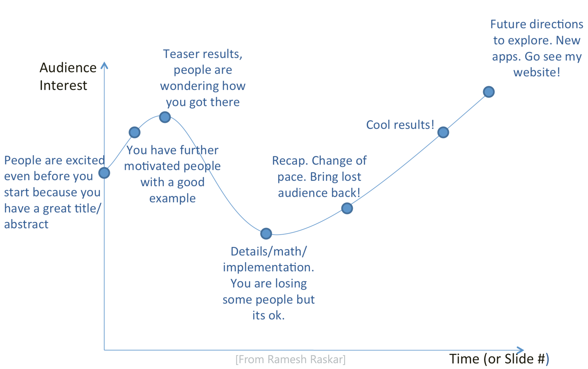
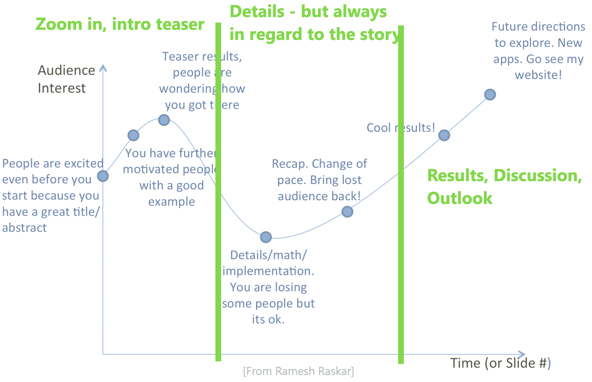
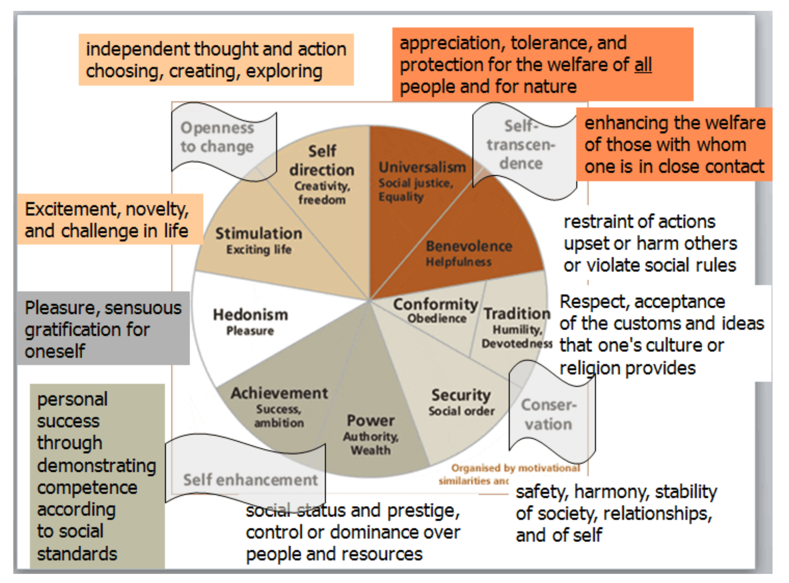

name: inverse
layout: true
class: center, middle, inverse
---

### (Part 2)  

# How To Give a Good (Research) Talk

### Prof. Dr. Lena Gieseke | l.gieseke@filmuniversitaet.de  

#### Film University Babelsberg KONRAD WOLF

---
layout:false

## Learning Objectives

* Awareness of the relevant aspects of a good talk
* Make deliberate decisions about your talk
* Control how you and your talk are received

---
layout:false

## Topics

* Getting started ✓
* Anatomy of a talk ✓
* Layout
* Delivering the talk

---

## Getting Started

.left-even[
> Facts don’t move people,   
> emotions do!

*(E-) motion*
* Excitement
* Curiosity
* Sympathy
* Hope
* …
]
.right-even[
.center[]
]

---
.header[Getting Started]

## Timing

* Know the time that you have

#**Deliver the given time!**

---
.header[Getting Started | Timing]

## Developing Content

* Tell a story
    * Everything else needs to follow the storyline  
    * If something doesn't add to or integrates into the overall story, out with it 
* Create a take-home message
    * What is in it for the audience?
    * This is difficult

> You always want a positive emotional response 😍

---
## Anatomy of a Talk

.center[]

---
## Anatomy of a Talk

.center[]

---
layout:false

## Topics

* Getting started ✓
* Anatomy of a talk ✓
* **Layout**
* Delivering the talk

---
template:inverse

# Layout

---
.header[Layout]

## Media

???
.task[COMMENT:]  

* What is the main medium of your presentation?

--

.center[]

---
.header[Layout]

## Media

.left-even[
]
.right-even[
# You are the main medium!
]

---
.header[Layout]

## Media

.left-even[
]
.right-even[
You are the main medium!  

> The slides should support you!
]

---
.header[Layout]

## Visual Layout

--

* Don’t clutter your slides

--
    * Just add more slides!

---
.header[Layout]

## Visual Layout

* I will dive straight into the problem, assuming you know as much as I do about the topic in general and the specific problems I’m trying to solve in particular
* I will throw my solutions at you without a warning, without any motivation, or any insight about the key observations that lead to the proposed solution
* I will also write Every. Single. Word. I will articulate, thus limiting myself to simply reading the slides, while filling the space with lots and lots of words that you may or may not read but hey words are free right? So why not keep typing until I simply run out of space and then I’ll just add a new slide and continue
* My solution could make the world a better place but no-one will know about my ideas because I gave such a bad presentation that made everybody dislike the topic.

---
.header[Layout]

## Visual Layout

* Use simple sentences, one idea per sentence

--
* Large fonts: 20-point and higher

--
* ~ Six lines per slide

---
.header[Layout]

## Visual Layout

--
* Check your spelling
* Keep it grammatically sane

--
* Be consistent with your fonts and style
    * Start bullets with upper case?

---
.header[Layout]

## Visual Clutter

.center[]

---
.header[Layout]

## Visual Layout

.center[]

---
.header[Layout]

## Visual Layout

.left-even[]

.right-even[
* Always guide your audience
    * E.g. build up graphical elements
]

---
.header[Layout]

## Visual Layout

.left-even[]

.right-even[
* Always guide your audience
    * E.g. build up graphical elements
* Otherwise they get distracted in the best case and frustrated in the worst case
]

---
.header[Layout]

## Visual Layout

.left-even[]

.right-even[
> Refer to everything on the slide orally.
]

---
.header[Layout | Visual Layout]

## Media

* Ideally have all files downloaded

---
.header[Layout]

## Design

--
* Think about the design

--
    * Does it complement the content and your story?
--
    * How does it reflect on you?

--

> The visual design should match your storyline.

---

.center[]

---

.center[]

---

.center[]

---
.header[Layout]

## Visual Layout

--
* Be aware of low quality projectors and possible light conditions

--
* Black vs. white background?
    * Personal taste
    * Use the opposite of the natural background for creating a framing

---
.header[Layout]

## Visual Layout 😱

* Layouting is a time trap - be aware!

---
.header[Layout]

## Visual Layout 🤬

* Keep emojis to a minimum

--
...or not.

---
layout:false

## Topics

* Getting started ✓
* Anatomy of a talk ✓
* Layout ✓
* **Delivering the talk**

---
template:inverse

# Delivering the Talk

---
.header[Delivering the Talk]

## Media

.left-even[
]
.right-even[
# You are the main medium!
]

---
.header[Delivering the Talk]

## Media

You are the main medium!

* Make use of it

--
* Communicate with your audience
    * Focus on communicating rather than performing 
--
    * It depends...

--

> The slides should support you!

---
.header[Delivering the Talk]

## Getting Prepared

--

* Practice, practice, practice… 

--
    * This is the only way to know your timing
--
    * This will make you self-confident
--
* Reading pre-written text usually works well

--
* Add moments for going off script

---
.header[Delivering the Talk]

## Getting Prepared

* Practice in front of an audience
    * Listen to their feedback
???
.task[COMMENT:]  

* Feedback in terms of content AND in terms of the presentation and formal aspects

--
* If they didn’t get it, it’s your fault!

---
.header[Delivering the Talk]

## You are the main medium!

.center[]

---
.header[Delivering the Talk]

## You are the main medium!

* Be present

--
* Your attitude, tone of voice, rhythm… it all counts

--
* Cloths do matter
    * Wear something as comfortable as possible
    * Don’t distract your audience

---
.header[Delivering the Talk]

## You are the main medium!

* Be confident

--
    * Your work has already been reviewed / You have been invited 
    * Fake it…
--
* Believe and like what you talk about

--
* Show enthusiasm

---

## Delivering The Talk

> Don't start with any negative announcement..  
  

--
* I didn’t have time to prepare…
* I have a jetlag
* To little time for the topic
* This is going to be boring...
  
--
  
> Just keep it inside and be confident.

--

* If you must, say it after the talk

---

## Delivering The Talk

* **Be authentic**

--
    * This usually means vulnerable

---
## Delivering The Talk

* Stand whenever possible

???
.task[COMMENT:]  

* This is scary, I know…

--
* Walk up to the slides but do not turn to them
* Use a pointer / mouse

--
* For the shorter ones: does the speaker table fit your size?

---
## Delivering The Talk

* Know the specific setup for your talk in advance

--
    * Are you able to see your notes?
    * Do you have to hold a micro? …and a presenter?

???
.task[COMMENT:]  

* Visualize yourself in the setup
    * E.g., walking up to the podium, starting the talk, etc. 
    * Helps against nervousness

---

## Delivering The Talk

* Look at the people
    * Not your monitor, not the screen
    * Don’t be intimidated by facial expressions (they are usually completely random)

---

## Delivering The Talk

* Better leave out stuff, than rush

--
    * Always!
    * Make navigation jumps
    * Don't let the audience see what they are missing

---

## Delivering The Talk

* Don't oversell
    * Be honest with the scope of your contribution / achievement / proposal
    * Again, be authentic
--
* Don’t take all the credit
    * Avoid the me, myself and I

---

## Delivering The Talk

--
* If you make a mistake, say so and start over

--
* If there is an interruption, acknowledge it

---

## Delivering The Talk

* Make pauses, change pace, vary intonation
    * Ask for feedback
    * Practice
--
* Have transitions between topics, e.g., breath, take a sip of water

---

## Delivering The Talk

* Start with the beginning of the sentence before switching the slide

--

> Be in sync with what is on the slide!
  
--
  
* Use similar wording
* Integrate the bullet points into your spoken sentences

---
layout:false

## Topics

* Getting started ✓
* Anatomy of a talk ✓
* Layout ✓
* Delivering the talk ✓
* **Q&A**

---
template:inverse

# Q&A

---

## Q&A

--
* Concentrate

--
    * Consider taking notes

???
.task[COMMENT:]  

* Be confident

--
* It is ok to ask them to repeat, or repeat yourself

--
* If you don’t know the answer, simply say so

--
* If it gets too involved, take the discussion off-line and move on
    * The chair should help you with this

---
layout:false

## Topics

* Getting started ✓
* Anatomy of a talk ✓
* Layout ✓
* Delivering the talk ✓

---
template:inverse

# Summary

---

## In Summary

### Take Home Messages 😁

--
* You are the main medium

--
* Choose your message, tell a story

--
* Motivation, motivation, motivation

--
* Structure your talk

--
* Avoid lengthy derivations of the details

--
* Build recovery points

--
* End your talk in a positive way

--
* Deliver the given time

---
template: inverse

# The End
# ⭐️
